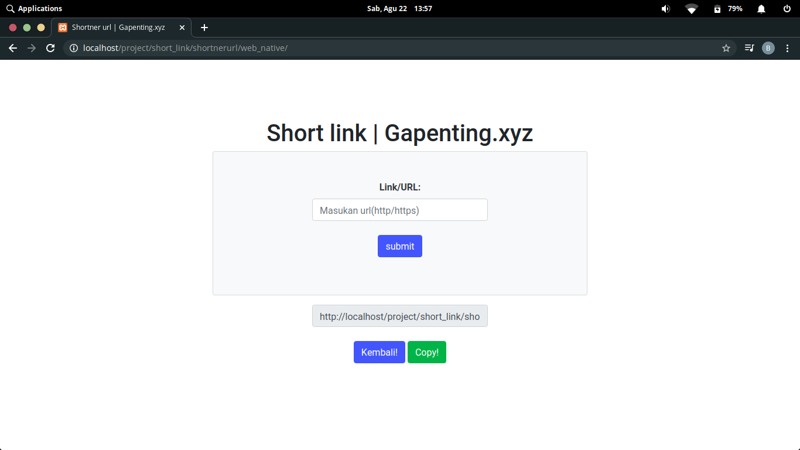
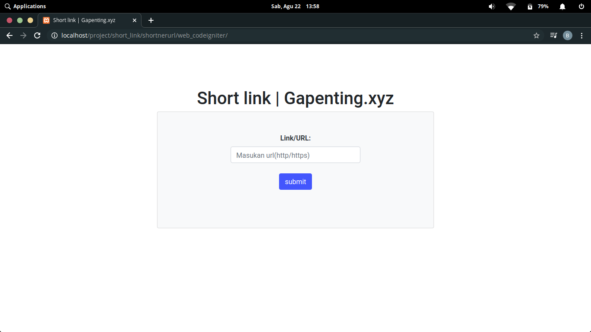

# shortnerUrl

<br>

Di google udah ada emang, tapi saya cuman ingin membongkar ulang codingannya:)

<br>

# Cara Pemakaian (Web native)

```
1. download dulu filenya.
2. folder ada di web_native
3. buka file config.php lalu konfigurasikan sesuai database anda & konfigurasikan variable host ($host) di codingan config.php sesuai host anda!
4. import database(url.sql)
5. website pemendek url siap digunakan!
```

<br>

# Cara pemakaian (Web codeigniter)

```
1. download dulu filenya.
2. folder ada di web_codeigniter.
3. buka file config.php pada folder application > config > config.php
4. edit codingan $config['base_url'] sesuai host kalian.
5. edit codingan database yang ada di folder application > config > database.php ubah sesuai phpmyadmin anda sendiri!
6. import database (url.sql)
7. website siap digunakan!
```

<br>

# PICT


<br>



